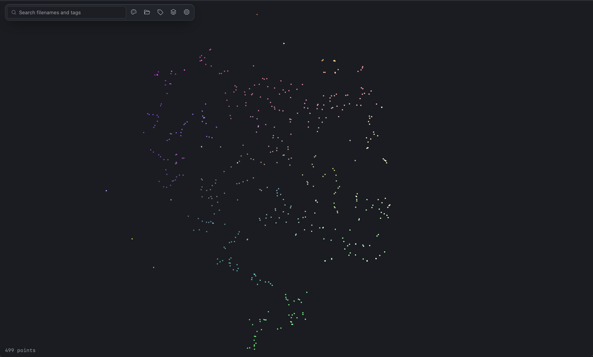

# AudioCloud

AudioCloud is a macOS app for browsing large audio-sample libraries as an interactive 3D map.
Import a folder, search and filter your samples, click a point to audition it, and explore nearby
sounds.



## Tech stack

- **App shell:** [Tauri 2](https://tauri.app) (Rust backend, system WebView)
- **Frontend:** React 19, TypeScript, Vite, Tailwind CSS 4, Zustand, and Three.js via
  React Three Fiber/drei for the point cloud
- **Audio decode and analysis (Rust):** `symphonia` (decode), `rubato` (resample), `realfft`
  (spectral analysis), `ebur128` (loudness), `rayon` (parallel workers)
- **Playback:** `cpal` output stream fed through a lock-free ring buffer (`ringbuf`)
- **Storage:** SQLite (`rusqlite`, bundled, with FTS5 search and `refinery` migrations) plus a
  memory-mapped f16 vector file
- **Projection:** PCA and Barnes-Hut t-SNE (`nalgebra`, `bhtsne`), with a vendored `annembed`
  UMAP available as an alternative
- **Hashing and discovery:** `ignore` (parallel directory walk), `blake3`
- **IPC types:** generated TypeScript bindings from Rust via `ts-rs`

## How audio is processed

AudioCloud processes samples locally; there is no model to download and nothing leaves your
machine.

1. **Discover.** A parallel walk finds files with a supported extension (WAV, AIFF, CAF, FLAC,
   MP3, M4A/AAC/ALAC, Ogg Vorbis, Matroska audio). Each file is hashed with BLAKE3 (very large
   files are sampled from the head and tail). Unchanged files are skipped on re-scan by
   path, modified time, and size, and identical content is embedded once and shared.
2. **Decode.** `symphonia` decodes the file, downmixes to mono, and resamples to 48 kHz. Decoding
   stops after the first 10 seconds, so long files are analysed by their opening window.
   Files that cannot be decoded are recorded rather than silently dropped.
3. **Analyse.** From 1024-point frames (10 ms hop) the app computes peak, RMS, integrated LUFS,
   spectral centroid and flatness, zero-crossing rate, onset density, and estimated BPM and
   key. BPM and key are estimates and can be wrong, particularly for one-shots and
   percussion. It also computes a 64-band log-mel spectrogram.
4. **Embed.** Each sample becomes a 45-number vector: the mean and standard deviation of 20 MFCCs
   over the sound (timbre, 40 numbers) plus five envelope numbers (attack time, decay time,
   head-to-tail energy ratio, log length, and whether the 10 s cap was hit). Each number is
   standardized against fixed corpus statistics and clipped at ±5 standard deviations. The
   vectors are stored as f16 and are not L2-normalized.
5. **Compare.** Similarity is the cosine between two standardized vectors, floored at `0` and
   shown as a percentage.
6. **Project.** The vectors are placed on a 2D map with Barnes-Hut t-SNE (after PCA to 30
   dimensions), and a second, independent 3D t-SNE fit supplies each point's color. If the
   fit fails, PCA is used as a fallback. When a scan adds fewer than 2% new samples, they are
   placed next to their nearest neighbors and no existing point moves; larger imports trigger
   a full re-fit, which is aligned to the previous layout so the map does not jump.

The vectors are deterministic: the same audio content produces the same vector. Similarity is
based on timbre and on how long and how quickly a sound decays, so it is most useful for finding
samples with similar character and shape, not for identifying the same musical role in every
context. Because only the first 10 seconds are analysed, and the map is a 2D approximation,
nearby points are a good starting point rather than a guarantee of similarity.

The standardization constants live in `src-tauri/src/pipeline/mfcc_stats.rs` and are generated from a
library with `cargo run --release --example mfcc_stats -- <app data dir> src/pipeline/mfcc_stats.rs`.
Changing them changes every stored vector, so it needs a migration that re-embeds.

## Requirements

- macOS 11 or later
- Apple Silicon (`aarch64-apple-darwin`)
- Rust stable
- Node.js version listed in [`.nvmrc`](.nvmrc)
- Xcode Command Line Tools

Install the Rust target and JavaScript dependencies:

```sh
rustup target add aarch64-apple-darwin
npm ci
```

## Run locally

```sh
npm run tauri -- dev
```

Useful checks:

```sh
npm run format:check
npm run lint
npm run typecheck
cargo clippy --manifest-path src-tauri/Cargo.toml --all-targets -- -D warnings
cargo test --manifest-path src-tauri/Cargo.toml --all-features
```

Build the macOS app with:

```sh
npm run tauri -- build
```

## Data storage

AudioCloud stores its local database and generated vectors at:

```text
~/Library/Application Support/com.audiocloud.app/
```

The stored data is derived from the files in your library. Removing this directory resets the
index; your original audio files are not affected.

## Project structure

- `src/` — React, TypeScript, and Three.js frontend
- `src-tauri/src/pipeline/` — file discovery, audio decoding, feature extraction, and vector generation
- `src-tauri/src/projection/` — PCA, t-SNE, UMAP, re-fit, and incremental placement
- `src-tauri/src/audio/` — sample preview playback
- `src-tauri/src/db/` — SQLite metadata and the memory-mapped vector store
- `src-tauri/tests/` — Rust integration tests

## License and inspiration

AudioCloud is licensed under the [Apache License 2.0](LICENSE).

The spatial audio-browser concept was inspired by Google Creative Lab's [AI Experiments Drum
Machine](https://github.com/googlecreativelab/aiexperiments-drum-machine). That project is credited
for inspiration and is not included in this repository.
