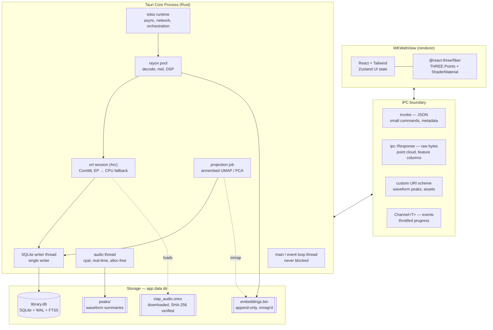

# AudioCloud — System Architecture & Design

A desktop ML sample visualizer for macOS. Scans a user's sample library, embeds every
file with a CLAP audio encoder, projects the embedding space to 3D, and renders the
result as an interactive point cloud with instant audition.

**Status:** architecture of record. No application code exists yet. See `task.md` for the
implementation roadmap.

---

## 1. System Overview

AudioCloud turns a folder of audio files into a navigable space. Similar-sounding samples
land near each other, so a user finds "that kind of kick" by flying to a region rather
than by remembering a filename.

Everything expensive — file walking, decode, DSP, ML inference, dimensionality reduction,
persistence, audio playback — happens in Rust inside the Tauri core process. The WebView
does exactly one job: draw points and handle input. This split is what makes the ~15MB
binary and the low idle footprint achievable.



### Design constraints

These are the numbers the architecture is built to hit. Section 7 turns each into a
measurable target with a method.

| Constraint       | Target                               | Why it drives the design                                   |
| ---------------- | ------------------------------------ | ---------------------------------------------------------- |
| Library size     | 50,000+ samples, headroom to 250k    | Forces streaming decode, out-of-DB embeddings, GPU picking |
| Idle RSS         | < 300 MB steady-state                | No heap-resident embedding matrix; mmap for re-fit         |
| Render           | 60 fps sustained orbit at 50k points | One draw call, one buffer, no per-frame React              |
| Cold start       | < 2 s to interactive                 | Lazy ML session init; point cloud loads as one binary blob |
| Binary size      | ~15 MB `.app`                        | No Chromium, no Node runtime, no Python interpreter        |
| Audition latency | < 50 ms hover-to-sound               | Native audio thread, decode-ahead cache                    |

Hover-to-sound is not a property of the map. Anywhere a sample is *named* — a point, a search
result, a collection member, the inspector's neighbor list — hovering it plays it. The map
reports its GPU pick and a list row reports its pointer enter into the same
`store/scene.ts` field, and `src/audition.ts` is the only thing that turns that field into
sound, so the rule is written once and every surface gets it (along with the map highlight and
the neighbor lookup that already watch the same field).

### What "no Node/Python dependencies" actually means

This claim is true of the shipped binary and false of the toolchain. Stating it precisely
now avoids an unpleasant surprise in Phase 0.

1. **Node (or Bun) is required at build time.** Vite, TypeScript, and Tailwind are
   build-time tooling. They emit static HTML/CSS/JS that Tauri embeds in the binary.
   Nothing Node-related is linked into or shipped with the `.app`. The user never
   installs Node.
2. **Python is required exactly once, by a developer, offline.** The LAION CLAP audio
   tower ships as PyTorch weights. Exporting it to ONNX needs `torch` + `transformers`
   once. The resulting `.onnx` is a build artifact, checked in or published to a release
   asset. No Python touches the user's machine, the runtime, or CI after export.
3. Both facts are toolchain-only. The runtime dependency set of the shipped app is: the
   Rust binary, the ONNX Runtime dylib, the downloaded model, and macOS system frameworks.

Section 10 carries the remaining risks.

---

## 2. Tauri v2 Process & Thread Model

### Processes

Tauri v2 on macOS runs two kinds of process. The **core process** is the Rust binary: it
owns the event loop, all state, all threads, and every file handle. The **WebView process**
is WKWebView, sandboxed by the OS, with no filesystem or network reach except what the
core explicitly hands it.

Nothing crosses that boundary except serialized messages. There is no shared memory, no
SharedArrayBuffer bridge, no pointer passing. Every design decision in Section 6 follows
from this: the boundary is a copy, so the only lever is making the copy small and making
it happen rarely.

### Threads inside the core process

Five distinct execution contexts, deliberately separated:

| Context           | Population            | Owns                                                                              | Must never                                             |
| ----------------- | --------------------- | --------------------------------------------------------------------------------- | ------------------------------------------------------ |
| Main / event loop | 1                     | Window, menu, tray, `AppHandle`                                                   | Block. Ever. Any blocking call here freezes the window |
| `tokio` runtime   | N worker threads      | Async orchestration, network (model download), pipeline supervision, cancellation | Do sustained CPU work                                  |
| `rayon` pool      | `num_cpus - 1`        | Decode, resample, mel, DSP descriptors, inference batching                        | Do blocking I/O that starves the pool                  |
| Audio thread      | 1, real-time priority | `cpal` output stream callback                                                     | Allocate, lock, log, or touch SQLite                   |
| SQLite writer     | 1                     | The single write connection                                                       | Be duplicated — see §4                                 |

The two runtimes coexist rather than compete: `tokio` for waiting, `rayon` for computing.
Pipeline stages that are I/O-bound (walking, downloading) live on `tokio`; stages that
are CPU-bound (decode, mel, inference) live on `rayon`. Handoff between them is via
bounded channels, never via `block_on` inside a `rayon` task.

The audio thread is the strictest. Its callback runs on a deadline enforced by CoreAudio;
missing it produces an audible glitch. It receives samples through a lock-free SPSC ring
buffer (`ringbuf`) filled by a decode-ahead task on `tokio`. The callback itself does
nothing but copy and apply gain.

### Capabilities and the ACL

Tauri v2 replaces the v1 allowlist with a capability system: JSON manifests in
`src-tauri/capabilities/` grant specific permissions to specific windows.

```jsonc
// src-tauri/capabilities/main.json
{
  "identifier": "main-window",
  "windows": ["main"],
  "permissions": [
    "core:default",
    "core:window:allow-start-dragging",
    "dialog:allow-open", // folder picker for library roots
    "os:allow-os-type",
    "updater:default",
  ],
}
```

The set is deliberately minimal. Notably absent: the `fs` plugin. The frontend never
touches the filesystem — it asks the core for data by sample ID and gets bytes back.
Removing `fs` from the capability set removes an entire class of path-traversal bug from
the threat model.

### Why the app is not App-Sandboxed

AudioCloud's core function is scanning arbitrary user-chosen folders, typically large
sample libraries on external drives. The macOS App Sandbox permits this only through
security-scoped bookmarks, which must be re-resolved per launch and are fragile across
volume remounts — exactly the failure mode that would make a library silently empty
itself after a reboot.

The app therefore ships **unsandboxed, Developer ID signed, hardened runtime enabled,
and notarized**. This is fully supported for direct distribution outside the Mac App
Store. It does mean the Mac App Store is closed to the app as designed; if that ever
becomes a requirement, security-scoped bookmarks become a Phase-1-level schema concern
(persisting bookmark blobs per library root), not a late patch.

---

## 3. Rust Audio & ML Pipeline

The core of the system. A five-stage pipeline connected by bounded channels, so
backpressure propagates naturally and memory stays flat regardless of library size.

```
walk ──▶ [chan 4096] ──▶ decode ──▶ [chan 256] ──▶ mel ──▶ [chan 64] ──▶ embed ──▶ [chan 1024] ──▶ persist
 1 task                  N=cores                  N=cores               1 batcher                  1 writer
 tokio                   rayon                    rayon                 rayon + ort                dedicated
```

Queue depths shrink as payloads grow. A path is ~100 bytes, so 4096 of them is nothing.
A decoded 10s mono f32 buffer at 48kHz is 1.92 MB, so the decode output queue is capped
at 256 — about 500 MB worst case, which is why decode output is actually handed over as
mel frames wherever possible (see below) and the 256 is a ceiling never reached in
practice. A mel tensor is 64 × ~1000 × f32 = 256 KB; 64 in flight is 16 MB.

**Backpressure is the memory strategy.** There is no global "load everything" step at any
stage. If inference is the bottleneck — it is — the mel stage blocks, which blocks decode,
which blocks the walk. Peak RSS is bounded by queue depths times payload size, both of
which are compile-time constants.

### 3.1 Discovery

`ignore::WalkBuilder` in parallel mode (`build_parallel()`), not `jwalk`.

> `jwalk` was the obvious pick and is what a lot of prior art uses, but its crates.io
> description now reads _"Use `dua-core` instead"_ — the author has deprecated it.
> `ignore` is BurntSushi's walker from ripgrep: parallel, actively maintained, and it
> gets `.gitignore`/hidden-file semantics for free, which is useful for skipping
> `.DS_Store` and DAW project cruft.

Per entry: extension filter against a known-audio set, `symlink` loop guard, size sanity
bounds (reject 0-byte, flag > 500 MB for streaming-only treatment).

**Content hashing with `blake3`** serves two purposes. It deduplicates — sample libraries
are full of the same 909 kick under six names — and it makes re-scans cheap: a file whose
`(path, mtime, size)` is unchanged is skipped without hashing, and a file whose hash
matches an existing row is linked rather than re-embedded. `blake3` is chosen over SHA-2
because it is several times faster on the multi-GB scans this does routinely, and
cryptographic strength is not the requirement here — collision resistance is.

For files over a threshold (say 64 MB), hash only the first and last 1 MB plus the length.
Full hashing of a 2 GB stem file to decide whether to embed its first 10 seconds is waste.

### 3.2 Decode

`symphonia` — pure Rust, no C dependency, covers wav, flac, mp3, aac, alac, ogg/vorbis.
This is the single biggest reason the binary stays small; the alternative is linking
FFmpeg.

The decode path is strictly streaming and strictly capped:

1. Probe format, read metadata (duration, channels, sample rate, embedded tags).
2. Decode packets until **10 seconds of output at 48 kHz has been produced, then stop.**
   The CLAP audio window is 10s. Decoding a 6-minute track in full to use its first 10
   seconds is the difference between a 40-minute scan and a 4-hour one.
3. Downmix to mono during decode by summing and scaling, not by materializing a stereo
   buffer and collapsing it after.
4. `rubato` resample to exactly 48 kHz if the source differs. Sinc interpolation quality
   is set to a middle profile; this feeds an ML model, not a mastering chain.
5. Emit a single `Vec<f32>` of at most 480,000 samples, pulled from a pool (§3.6).

Short samples — most of a drum library — are zero-padded to the window at the mel stage,
not here.

**Failure handling:** a decode error quarantines the file rather than killing the scan.
The row is written with `status = 'decode_failed'` and the error string, so the UI can
show "1,203 files could not be read" with a list, instead of the scan silently producing
fewer points than the user has files.

### 3.3 Feature extraction

Two things happen in one pass over the decoded buffer.

**Mel spectrogram for CLAP.** `realfft` (real-input FFT, roughly 2x the throughput of a
general complex FFT for this case) with the HTSAT input contract:

| Parameter     | Value                                 |
| ------------- | ------------------------------------- |
| Sample rate   | 48,000 Hz                             |
| Window        | 1024, Hann                            |
| Hop           | 480                                   |
| Mel bins      | 64                                    |
| f_min / f_max | 50 Hz / 14,000 Hz                     |
| Window length | 10 s → 480,000 samples → ~1000 frames |
| Scale         | log-mel, natural log, epsilon-floored |

> **Verify these against the exported graph, do not trust this table.** These are the
> documented LAION CLAP/HTSAT values, but the exact frame count the ONNX graph expects
> (1000 vs. 1001 vs. a padded 1024) and whether normalization is baked into the graph or
> expected from the caller depend on how the export was done. Phase 3's exit criterion is
> a numerical parity check: the same wav through Python CLAP and through this pipeline
> must produce embeddings with cosine similarity > 0.999. Getting this wrong produces
> embeddings that are subtly, silently wrong — the map looks plausible and the neighbors
> are garbage.

**Cheap DSP descriptors**, computed from the same FFT frames because the transform is
already paid for: peak, RMS, integrated loudness (`ebur128`), spectral centroid, spectral
flatness, zero-crossing rate, onset density, estimated BPM, estimated key. These power
the "color by" controls and the numeric filters, and they are what the UI falls back to
when the ML pipeline hasn't run yet — which is why Phase 2 ships before Phase 4.

### 3.4 Inference

`ort` 2.0.0-rc.13 (wrapping ONNX Runtime 1.28).

One `Session`, built once, shared across `rayon` workers as `Arc<Session>`. Session
construction is expensive — hundreds of milliseconds — and thread-safe for concurrent
`run()` calls, so building per-worker is pure waste.

Execution providers, in order: **CoreML EP, falling back to CPU.** The fallback must be
real and tested, not aspirational — CoreML rejects graphs with unsupported ops and will
either partition around them or refuse. Log which EP actually bound at session init.

**Batching.** Per-sample `run()` calls are dominated by fixed overhead. The embed stage
accumulates mel tensors into a batch of 16–32 (tune in Phase 4), stacks them into one
`[B, 1, 64, T]` input tensor, and runs once. A batcher with a flush timeout prevents the
tail of a scan from waiting forever for a batch that will never fill.

Output: `[B, 512]` f32. L2-normalize immediately — cosine similarity becomes a dot
product, and UMAP's distance metric assumes it.

### 3.5 Model provisioning

The CLAP ONNX file is ~150–200 MB. Bundling it into a "15 MB binary" is a contradiction,
so it is downloaded on first launch.

Flow: check app data dir → if absent, show a first-run screen → `reqwest` streaming
download with `Range` support for resume → SHA-256 (`sha2`) over the stream as it lands →
compare against a hash constant compiled into the binary → `fsync` → **atomic rename**
into final position.

The atomic rename is the important part. Download to `clap_audio.onnx.partial` and
rename only after verification, so a killed download or a power loss can never leave a
truncated file that looks valid on next launch. Progress goes to the UI over a `Channel`
(§6), throttled like everything else.

Failure is a first-class UI state, not a panic: no network, hash mismatch, disk full,
and interrupted-and-resumable are four different messages with four different actions.

### 3.6 Memory discipline

- **Streaming everywhere.** No stage holds more than its queue depth allows.
- **Buffer pools.** Decode buffers (1.92 MB) and mel buffers (256 KB) are recycled
  through a pool rather than allocated per sample. At 50k samples, per-sample allocation
  of these is ~100 GB of churn through the allocator for no reason.
- **Embeddings are never fully heap-resident.** They append to `embeddings.bin` as they
  are produced and are read back via `memmap2` when the projection job needs the matrix.
  50k × 512 × f32 = 102 MB; f16 storage halves it to 51 MB. Under mmap the OS pages what
  the job touches and evicts under pressure, which is exactly the behavior wanted for a
  once-in-a-while batch job that must not blow the 300 MB budget.

### 3.7 Projection to 3D

512 dimensions to 3, behind a trait so the implementation is swappable:

```rust
pub trait Projector: Send + Sync {
    fn fit_transform(&self, embeddings: &EmbeddingMatrix, ct: &CancellationToken)
        -> Result<Vec<[f32; 3]>, ProjectionError>;
    fn name(&self) -> &'static str;
}
```

Two implementations:

- **`PcaProjector`** — `nalgebra` truncated SVD. Fast, deterministic, boring, always
  works. Ships first, in Phase 5, so the frontend gets real coordinates while UMAP is
  still being wired. Also the permanent fallback if `annembed` fails or is abandoned.
- **`UmapProjector`** — `annembed` 0.1.6 over an `hnsw_rs` kNN graph. This is what
  produces the layout worth looking at: PCA spreads variance, UMAP spreads _neighborhood
  structure_, which is what makes "similar samples are near each other" true locally.

Parameters to expose: `n_neighbors` (15 default; lower = more local clusters, higher =
more global shape), `min_dist` (0.1), metric = cosine, target dim 3.

> **`annembed` is the thinnest dependency on the critical path.** Version 0.1.6, ~30k
> lifetime downloads, small maintainer surface. It is genuinely good work — HNSW-
> initialized, fully parallel, quality competitive with Python UMAP — and it is the only
> credible Rust-native UMAP. But it is a 0.1.x crate holding up a headline feature.
> Mitigation, all three: pin the exact version, vendor the source into the repo so an
> upstream yank cannot break a build, and keep `PcaProjector` behind the same trait as a
> tested fallback rather than a theoretical one.

### 3.8 Re-fit and layout stability

New samples arrive constantly. The naive answer — re-fit UMAP over everything on every
import — is correct for layout quality and catastrophic for the user, because UMAP's
output has no canonical orientation. Re-fitting rotates, reflects, and reshuffles the
entire map, so the user's spatial memory of where their kicks live is destroyed by
importing twelve files.

Two paths, chosen by import size:

**Small imports (below ~2% of corpus): incremental placement.** Do not re-fit. For each
new embedding, find its k nearest neighbors among already-projected samples via the
existing HNSW index, and place it at the similarity-weighted barycenter of their 3D
positions, with a small jitter to avoid exact coincidence. Cheap, instant, and by
construction it does not move a single existing point. Layout quality degrades slowly as
these accumulate, which is what triggers the other path.

**Large imports, or accumulated drift past a threshold: full re-fit as a background job**,
followed by **Procrustes alignment** of the new layout onto the old one:

1. Take the points present in both layouts.
2. Center both, compute the cross-covariance `H = Aᵀ B`, take `SVD(H) = U S Vᵀ`.
3. Optimal rotation `R = V Uᵀ`; allow reflection (UMAP axes carry no meaning, so
   forbidding reflection only makes the fit worse); optimal uniform scale from the ratio
   of singular value sum to source variance.
4. Apply `R` and scale to the *entire* new layout, including new points.
5. Write to a shadow projection row set, then **atomically swap** — `BEGIN IMMEDIATE`,
   update the active projection version pointer, commit. Readers never observe a
   half-swapped map.

The job is cancellable, runs at low priority, and reports progress like any other.

**Be honest about what this buys.** Procrustes fixes the global transform — rotation,
reflection, scale. It cannot fix genuine reorganization: if adding 20,000 samples causes
UMAP to legitimately decide two clusters should merge, no rigid alignment will preserve
the old picture, because the old picture is now wrong. Procrustes converts "everything
moved" into "most things stayed, some things genuinely changed," which is the best
available outcome. The UI should still say a re-fit happened rather than letting the map
change under the user's cursor unannounced.

---

## 4. SQLite Data Layer

`rusqlite` (0.40) with bundled SQLite. One writer thread, a read pool, and embeddings
kept deliberately outside the database.

### 4.1 Schema

```sql
-- Library roots the user has added. Kept separate so a root can be
-- rescanned, disabled, or removed without orphaning sample rows.
CREATE TABLE library_roots (
    id            INTEGER PRIMARY KEY,
    path          TEXT    NOT NULL UNIQUE,
    label         TEXT,
    enabled       INTEGER NOT NULL DEFAULT 1,
    added_at      INTEGER NOT NULL,
    last_scan_id  INTEGER REFERENCES scan_runs(id) ON DELETE SET NULL
);

CREATE TABLE samples (
    id            INTEGER PRIMARY KEY,
    root_id       INTEGER NOT NULL REFERENCES library_roots(id) ON DELETE CASCADE,
    rel_path      TEXT    NOT NULL,          -- relative to root, so roots can move
    filename      TEXT    NOT NULL,
    ext           TEXT    NOT NULL,
    size_bytes    INTEGER NOT NULL,
    mtime         INTEGER NOT NULL,          -- with size, the cheap "unchanged?" check
    content_hash  BLOB,                      -- blake3, 32 bytes; NULL until hashed
    duration_ms   INTEGER,
    sample_rate   INTEGER,
    channels      INTEGER,
    status        TEXT    NOT NULL DEFAULT 'pending',
                  -- pending | decoded | embedded | decode_failed | missing
    error         TEXT,
    -- Location in embeddings.bin. NULL until the embed stage completes.
    emb_offset    INTEGER,
    emb_len       INTEGER,
    first_seen_at INTEGER NOT NULL,
    updated_at    INTEGER NOT NULL,
    UNIQUE (root_id, rel_path)
);

CREATE INDEX idx_samples_status ON samples(status);
CREATE INDEX idx_samples_hash   ON samples(content_hash) WHERE content_hash IS NOT NULL;
CREATE INDEX idx_samples_root   ON samples(root_id);

-- Separate table: written by a different pipeline stage, queried by the
-- filter UI far more often than the sample row, and nullable as a block.
CREATE TABLE sample_features (
    sample_id         INTEGER PRIMARY KEY REFERENCES samples(id) ON DELETE CASCADE,
    peak_db           REAL,
    rms_db            REAL,
    lufs_integrated   REAL,
    spectral_centroid REAL,
    spectral_flatness REAL,
    zero_crossing     REAL,
    onset_density     REAL,
    bpm               REAL,
    bpm_confidence    REAL,
    key_root          INTEGER,   -- 0-11, NULL if unpitched
    key_mode          INTEGER,   -- 0 minor, 1 major
    key_confidence    REAL
);

CREATE INDEX idx_features_centroid ON sample_features(spectral_centroid);
CREATE INDEX idx_features_bpm      ON sample_features(bpm);

-- Versioned so a re-fit can be built in the background and swapped atomically.
CREATE TABLE projection_runs (
    id           INTEGER PRIMARY KEY,
    algorithm    TEXT    NOT NULL,           -- 'umap' | 'pca'
    params_json  TEXT    NOT NULL,
    sample_count INTEGER NOT NULL,
    created_at   INTEGER NOT NULL,
    completed_at INTEGER,
    is_active    INTEGER NOT NULL DEFAULT 0
);

-- Exactly one active projection at a time. Enforced, not just intended.
CREATE UNIQUE INDEX idx_projection_active
    ON projection_runs(is_active) WHERE is_active = 1;

CREATE TABLE projections (
    run_id    INTEGER NOT NULL REFERENCES projection_runs(id) ON DELETE CASCADE,
    sample_id INTEGER NOT NULL REFERENCES samples(id) ON DELETE CASCADE,
    x REAL NOT NULL, y REAL NOT NULL, z REAL NOT NULL,
    PRIMARY KEY (run_id, sample_id)
) WITHOUT ROWID;

CREATE TABLE tags (
    id    INTEGER PRIMARY KEY,
    name  TEXT NOT NULL UNIQUE COLLATE NOCASE,
    color TEXT
);

CREATE TABLE sample_tags (
    sample_id INTEGER NOT NULL REFERENCES samples(id) ON DELETE CASCADE,
    tag_id    INTEGER NOT NULL REFERENCES tags(id)    ON DELETE CASCADE,
    PRIMARY KEY (sample_id, tag_id)
) WITHOUT ROWID;

CREATE INDEX idx_sample_tags_tag ON sample_tags(tag_id);

CREATE TABLE collections (
    id         INTEGER PRIMARY KEY,
    name       TEXT NOT NULL,
    created_at INTEGER NOT NULL
);

CREATE TABLE collection_members (
    collection_id INTEGER NOT NULL REFERENCES collections(id) ON DELETE CASCADE,
    sample_id     INTEGER NOT NULL REFERENCES samples(id)     ON DELETE CASCADE,
    position      INTEGER NOT NULL,
    PRIMARY KEY (collection_id, sample_id)
) WITHOUT ROWID;

CREATE TABLE scan_runs (
    id             INTEGER PRIMARY KEY,
    root_id        INTEGER REFERENCES library_roots(id) ON DELETE CASCADE,
    started_at     INTEGER NOT NULL,
    finished_at    INTEGER,
    files_seen     INTEGER NOT NULL DEFAULT 0,
    files_added    INTEGER NOT NULL DEFAULT 0,
    files_skipped  INTEGER NOT NULL DEFAULT 0,
    files_failed   INTEGER NOT NULL DEFAULT 0,
    status         TEXT    NOT NULL,   -- running | completed | cancelled | failed
    error          TEXT
);

-- Search over filename and tags. External-content FTS keeps one copy of the text.
CREATE VIRTUAL TABLE samples_fts USING fts5(
    filename,
    tags,
    content = '',
    tokenize = "unicode61 remove_diacritics 2 tokenchars '_-'"
);
```

`tokenchars '_-'` matters more than it looks: sample filenames are
`KICK_808_Distorted-02.wav`. Default tokenization splits on underscore and hyphen, so
searching `808` should hit — but keeping them as token characters lets a user search the
compound form too.

### 4.2 Embeddings live outside SQLite

50,000 × 512 × f32 = **102 MB** of embedding data. Putting that in BLOB columns works but
is the wrong shape for how it is used:

- It is written **once**, append-only, never updated in place.
- It is read in exactly two patterns: one row at a time (nearest-neighbor lookup for a
  selected sample) or **the entire matrix at once** (projection re-fit).
- The whole-matrix read wants contiguous memory it can hand to `annembed` as a slice.

So: `embeddings.bin` is a flat append-only file. `samples.emb_offset` / `emb_len` point
into it. Writing is an append plus an integer column update. Reading the matrix is
`memmap2` plus a cast to `&[f32]` — no deserialization, no 102 MB heap allocation, and
the OS pages in only what the job touches.

This also keeps `library.db` small — a few tens of MB at 50k samples — which keeps
`VACUUM`, backup, and the WAL cheap.

Storage in **f16** (`half` crate) is the default: 51 MB instead of 102 MB, and the
precision loss is far below the noise floor of a UMAP neighborhood computation. Widen to
f32 on read.

Compaction: deleted samples leave holes. A `compact_embeddings` maintenance job rewrites
the file and updates offsets inside one transaction, triggered when dead space exceeds
~25%. Not a startup path.

### 4.3 Pragmas

```sql
PRAGMA journal_mode = WAL;          -- readers never block the writer
PRAGMA synchronous  = NORMAL;       -- correct pairing with WAL; full fsync per txn is
                                    -- unnecessary when a crash costs a rescan, not data
PRAGMA foreign_keys = ON;           -- off by default in SQLite; the schema above needs it
PRAGMA mmap_size    = 268435456;    -- 256 MB
PRAGMA cache_size   = -65536;       -- 64 MB (negative = KiB)
PRAGMA temp_store   = MEMORY;
PRAGMA busy_timeout = 5000;
PRAGMA wal_autocheckpoint = 1000;
```

`foreign_keys` is per-connection, not per-database — it must be set on every connection
the pool hands out, which is what the `r2d2` customizer hook is for.

### 4.4 One writer, many readers

**SQLite permits exactly one writer at a time.** In WAL mode a second concurrent writer
does not queue politely; it returns `SQLITE_BUSY`. Under a 12-thread `rayon` pool all
trying to insert, that is a storm of retries and a scan that gets slower as it gets more
parallel.

The architecture forbids the situation rather than handling it:

- **One writer thread** owns the only write connection. Every mutation is a message on an
  `mpsc` channel with an optional oneshot reply. No other thread has a write handle — the
  type system enforces it, because no other thread is ever given one.
- **An `r2d2_sqlite` read pool** (~4 connections, read-only) serves queries. WAL means
  these never block on the writer.

The writer batches. During ingest it accumulates rows and commits every ~1000 or every
250 ms, whichever comes first. Per-row transactions at 50k rows means 50k fsync-adjacent
operations; batching turns a multi-minute insert phase into a sub-two-second one. The
time-based flush matters as much as the count-based one — otherwise the last partial
batch of a scan sits uncommitted until something else happens.

### 4.5 Migrations

`refinery` (0.9) with embedded SQL migrations, run at startup before any other connection
opens. Forward-only. Each migration is a numbered file in `src-tauri/migrations/`.

Because the DB is a derived cache — every row can be rebuilt by rescanning — a migration
that turns out to be genuinely intractable has an escape hatch the app can offer: rebuild
from scratch. That is not true of `tags`, `collections`, and `library_roots`, which
represent real user work. Those three tables are the ones that must survive every
migration and are what a pre-migration backup copies.

---

## 5. WebGL Visualization Layer

React Three Fiber over Three.js. The whole layer is built around one idea: **the GPU
draws 50,000 points in one call, and React is not involved per-frame.**

### 5.1 Points, not InstancedMesh

The brief specified `InstancedMesh`. The recommendation here is `THREE.Points` with a
custom `ShaderMaterial` instead, and the reasoning should be visible so it can be
overruled deliberately.

Both are one draw call. The difference is what crosses the bus per point:

|                         | `THREE.Points`                                  | `InstancedMesh` (quad)                         |
| ----------------------- | ----------------------------------------------- | ---------------------------------------------- |
| Vertices per point      | 1                                               | 4 + 6 indices                                  |
| Per-point attributes    | position (12B), color (12B), size (4B), id (4B) | same, **plus** a `mat4` instance matrix — 64 B |
| Per-point bytes         | ~32 B                                           | ~96 B+                                         |
| At 50k                  | ~1.6 MB                                         | ~4.8 MB                                        |
| Rotation per point      | No                                              | Yes                                            |
| Real geometry / shadows | No                                              | Yes                                            |

For position-only sprites, `Points` moves roughly a third of the data and skips the
instance-matrix attribute entirely. Screen-space sizing comes free from `gl_PointSize`.

**Choose `InstancedMesh` instead if** points later need real geometry (waveform glyphs
rather than dots), per-point rotation, or shadow casting. Those are real product
possibilities, so this is a recommendation, not a closed door — and the swap is contained
to one component if the buffer-building code is kept separate from the material.

> **One macOS-specific caveat to check in Phase 7, early.** WKWebView runs WebGL through
> ANGLE on Metal. Point-sprite support is present, but the maximum `gl_PointSize` is
> driver-dependent and can be as low as 64 px. Query `ALIASED_POINT_SIZE_RANGE` at init
> and clamp. If the cap turns out to be too low for the zoomed-in look the design wants,
> that is precisely the trigger to switch to `InstancedMesh` quads — which is why the
> check belongs at the start of Phase 7, not the end.

### 5.2 Geometry and buffers

One `BufferGeometry` for the entire cloud, built once from the binary IPC payload:

```ts
// Straight from the ArrayBuffer the core sent. No per-point JS object is ever created.
const positions = new Float32Array(buf, posOffset, count * 3);
geometry.setAttribute('position', new THREE.BufferAttribute(positions, 3));

const colors = new Float32Array(count * 3); // recomputed on "color by" change
const attrColor = new THREE.BufferAttribute(colors, 3);
attrColor.setUsage(THREE.DynamicDrawUsage);
geometry.setAttribute('aColor', attrColor);

const sizes = new Float32Array(count); // selection / filter emphasis
const attrSize = new THREE.BufferAttribute(sizes, 1);
attrSize.setUsage(THREE.DynamicDrawUsage);
geometry.setAttribute('aSize', attrSize);

const ids = new Float32Array(count); // GPU picking payload
geometry.setAttribute('aId', new THREE.BufferAttribute(ids, 1));
```

Position is **static** — it changes only on a projection swap, at which point the whole
buffer is replaced. Color and size are `DynamicDrawUsage` because filtering and selection
touch them constantly.

Per-point updates mutate the typed array directly and set `needsUpdate = true`. They do
**not** go through React state. A 50k-element array in a Zustand store that re-renders a
component tree on every hover is the single most reliable way to make this application
feel broken.

### 5.3 GPU picking

CPU raycasting against 50k points is not viable at interactive rates, and Three's
`Points` raycaster is a linear scan with a threshold.

Instead, an ID-color pass:

1. An offscreen `WebGLRenderTarget`, 1×1 scissored to the cursor, or a small
   downscaled target.
2. Re-render the cloud with a picking material that writes each point's `aId` encoded
   into RGBA as a 32-bit integer, no lighting, no blending, depth test on.
3. `readPixels` one pixel, decode, look up the sample.

`readPixels` synchronizes the GPU pipeline, which is a real stall — so it runs **on
demand only**: on click always, and on hover behind a rate gate, never during an active
orbit drag.

That gate was originally ~20 Hz, and that was a mistake worth recording. Suppressing picks
during a drag already removes the case the stall actually hurts, and the scene renders on
demand, so a pick between drags stalls a pipeline with nothing else queued — while 20 Hz put
0–50 ms of dead time in front of *every* audition, more than the whole rest of the
hover-to-sound chain combined, and quantized a cursor sweep so coarsely that most points
crossed were skipped without a sound. The gate is now 120 Hz: a bound against a pointer
device reporting faster than the display can matter, not a cost budget.

The alternative — a WebGL2 `PIXEL_PACK_BUFFER` with an async fence — removes the stall
and is worth doing if profiling shows the sync read hurting. It is a Phase 10
optimization, not a Phase 7 requirement.

### 5.4 Shading

Vertex shader: transform position, compute `gl_PointSize` with distance attenuation
(`size * scale / -mvPosition.z`) clamped to the queried device range, pass color through,
and apply a fog/depth fade so the far side of the cloud recedes rather than cluttering.

Fragment shader: soft circular sprite from `gl_PointCoord` with `smoothstep` edge falloff
— cheaper and sharper than a texture lookup — plus an emphasis ring for the selected
sample. Additive blending with `depthWrite: false` and `depthTest: true` gives the
luminous cluster look without the sorting artifacts of true alpha blending.

LOD is handled in the vertex shader rather than by swapping geometry: points beyond a
distance threshold shrink and fade, and points below a size threshold are discarded in
the fragment shader. No CPU-side culling pass, no geometry churn.

### 5.5 Render loop

```tsx
<Canvas frameloop="demand" dpr={[1, 2]} gl={{ antialias: false, powerPreference: 'high-performance' }}>
```

`frameloop="demand"` means an idle canvas costs zero GPU and zero battery — which for a
tool that sits open next to a DAW all day is the difference between a good citizen and a
fan-spinner. Frames are requested via `invalidate()` on: orbit input, filter change,
selection change, projection swap, and for the duration of any animated transition.

`antialias: false` because additive point sprites get no benefit from MSAA and it costs
fill rate at 50k overlapping sprites. `dpr` capped at 2 so a Pro Display XDR does not
quietly quadruple the fragment load.

### 5.6 State boundaries

Zustand holds UI state: selection, filters, color-by mode, camera bookmarks, panel
layout. It lives **outside** the R3F render loop.

The rule: **Zustand describes intent; imperative buffer mutation executes it.** Changing
the color-by mode writes one value to the store; a subscriber outside React reads it,
recomputes the color typed array, sets `needsUpdate`, and calls `invalidate()`. One
component re-renders — the control panel — not the scene.

React is used for the chrome: panels, lists, search, tag editor, settings. The canvas is
a single component that mounts once and is driven imperatively thereafter.

---

## 6. IPC Bridge

The boundary is a copy. Three transports exist so each payload takes the cheapest one.

### 6.1 Command surface

| Command                 | Args                               | Returns                        | Transport       |
| ----------------------- | ---------------------------------- | ------------------------------ | --------------- |
| `add_library_root`      | `path`                             | `LibraryRoot`                  | JSON            |
| `list_library_roots`    | —                                  | `LibraryRoot[]`                | JSON            |
| `remove_library_root`   | `rootId`                           | `()`                           | JSON            |
| `scan_library`          | `rootId`, `Channel<ScanProgress>`  | `scanId`                       | JSON + Channel  |
| `cancel_scan`           | `scanId`                           | `()`                           | JSON            |
| `get_point_cloud`       | `projectionRunId?`                 | **raw bytes**                  | `ipc::Response` |
| `get_feature_column`    | `feature`                          | **raw bytes** (`f32[]`)        | `ipc::Response` |
| `query_samples`         | `QueryFilter`                      | **raw bytes** (`u32[]` of ids) | `ipc::Response` |
| `get_sample_detail`     | `sampleId`                         | `SampleDetail`                 | JSON            |
| `get_similar`           | `sampleId`, `k`                    | `Neighbor[]`                   | JSON            |
| `get_waveform_peaks`    | `sampleId`                         | —                              | custom protocol |
| `play_sample`           | `sampleId`, `gain`                 | `()`                           | JSON            |
| `stop_playback`         | —                                  | `()`                           | JSON            |
| `set_tag` / `unset_tag` | `sampleId`, `tagName`              | `()`                           | JSON            |
| `list_tags`             | —                                  | `Tag[]`                        | JSON            |
| `create_collection`     | `name`, `sampleIds`                | `Collection`                   | JSON            |
| `reveal_in_finder`      | `sampleId`                         | `()`                           | JSON            |
| `start_refit`           | `params`, `Channel<RefitProgress>` | `runId`                        | JSON + Channel  |
| `get_model_status`      | —                                  | `ModelStatus`                  | JSON            |
| `download_model`        | `Channel<DownloadProgress>`        | `()`                           | JSON + Channel  |

### 6.2 Transport 1 — JSON `invoke`

The default. Small commands, single records, lists of tens. Serde on the Rust side,
generated TypeScript types on the JS side. Correct for everything above that is marked
JSON and wrong for everything that is not.

### 6.3 Transport 2 — raw bytes via `ipc::Response`

The point cloud is 50,000 points of `[f32; 3]` plus a `u32` id: **800 KB**. As JSON it is
roughly 3–4 MB of text that must be generated in Rust, parsed by JavaScript, materialized
as 50,000 objects, and then walked to build typed arrays — hundreds of milliseconds and a
GC spike that shows up as a stutter on load.

Tauri v2 returns raw bytes directly:

```rust
#[tauri::command]
async fn get_point_cloud(state: State<'_, App>) -> Result<tauri::ipc::Response, Error> {
    let pts = state.db.read().active_projection()?;   // Vec<(u32, [f32;3])>

    // Header: magic, version, count. Then a struct-of-arrays body:
    // all ids, then all xs, then all ys, then all zs.
    let mut buf = Vec::with_capacity(16 + pts.len() * 16);
    buf.extend_from_slice(b"ABPC");
    buf.extend_from_slice(&1u32.to_le_bytes());
    buf.extend_from_slice(&(pts.len() as u32).to_le_bytes());
    buf.extend_from_slice(&0u32.to_le_bytes());       // pad to 16B alignment
    for (id, _) in &pts { buf.extend_from_slice(&id.to_le_bytes()); }
    for (_, p) in &pts { buf.extend_from_slice(&p[0].to_le_bytes()); }
    for (_, p) in &pts { buf.extend_from_slice(&p[1].to_le_bytes()); }
    for (_, p) in &pts { buf.extend_from_slice(&p[2].to_le_bytes()); }
    Ok(tauri::ipc::Response::new(buf))
}
```

On the JS side this arrives as an `ArrayBuffer` and becomes `Float32Array` views with
zero copying and zero parsing.

**Struct-of-arrays, not array-of-structs**, and the 16-byte header exists to keep every
`Float32Array` view 4-byte aligned — an unaligned `new Float32Array(buf, offset, n)`
throws. Three wants interleaved XYZ for the position attribute, so the three planar
arrays are woven into one interleaved buffer once on arrival; that loop is a few
milliseconds and it keeps the wire format flexible for columns that are fetched
independently.

`query_samples` returns a raw `u32[]` of matching IDs for the same reason: a filter that
matches 30,000 samples should not become a 30,000-element JSON array.

### 6.4 Transport 3 — custom URI scheme

Waveform peaks are per-sample, requested on selection, and are pure binary. Routing them
through `invoke` means they compete with commands on the IPC handler.

```rust
.register_uri_scheme_protocol("abpeaks", move |ctx, request| {
    // abpeaks://localhost/<sample_id>
    let id = parse_id(request.uri());
    match peaks_for(id) {
        Ok(bytes) => http::Response::builder()
            .header("Content-Type", "application/octet-stream")
            .header("Cache-Control", "max-age=31536000, immutable")
            .body(bytes).unwrap(),
        Err(_) => http::Response::builder().status(404).body(Vec::new()).unwrap(),
    }
})
```

The frontend just does `fetch('abpeaks://localhost/1234')`. This gets HTTP caching in the
WebView for free, is naturally streamable, and keeps bulk asset traffic off the command
channel entirely. The same mechanism serves any future thumbnail or spectrogram image.

### 6.5 Events — and the throttling rule

Progress uses `tauri::ipc::Channel<T>`, which is the v2 mechanism for streaming from a
command back to a specific caller.

> **Anti-pattern, stated explicitly because it is the default thing to write:** emitting
> one progress event per file. At 50,000 files that is 50,000 IPC messages, each with
> serialization cost, each waking the WebView, each triggering a React state update. It
> does not inform the user — nobody reads 50,000 filenames — and it will make the UI
> unusable during precisely the operation where responsiveness matters most.

Progress is **coalesced and throttled to ≤ 10 Hz**. An atomic counter set is updated by
every stage without synchronization; a single ticker task reads the snapshot every 100 ms
and emits one message:

```rust
#[derive(Serialize, Clone)]
struct ScanProgress {
    scan_id: i64,
    phase: ScanPhase,            // Walking | Decoding | Embedding | Projecting
    files_seen: u64,
    files_done: u64,
    files_failed: u64,
    current_path: Option<String>, // sampled, not exhaustive — for texture, not accounting
    eta_seconds: Option<u64>,
}
```

A terminal event fires on completion, cancellation, or failure regardless of the tick
schedule, so the UI never sits at 99%.

### 6.6 Cancellation

A `tokio_util::sync::CancellationToken` is created per scan and cloned into every stage.
Each stage checks it between work items and drops its channel on cancel; the drop
cascades downstream and the pipeline unwinds without a coordinator. The scan row is
marked `cancelled`, partial results are kept — a half-scanned library is still useful, and
a resumed scan skips what is already `embedded`.

### 6.7 Error model

`thiserror` on the Rust side, serialized as a tagged enum, consumed as a TypeScript
discriminated union:

```rust
#[derive(Debug, thiserror::Error, Serialize)]
#[serde(tag = "kind", content = "detail", rename_all = "camelCase")]
pub enum AppError {
    #[error("model not installed")]        ModelMissing,
    #[error("model download failed: {0}")] ModelDownload(String),
    #[error("checksum mismatch")]          ChecksumMismatch { expected: String, got: String },
    #[error("database error: {0}")]        Database(String),
    #[error("could not decode: {0}")]      Decode { path: String, reason: String },
    #[error("path not found: {0}")]        NotFound(String),
    #[error("scan already running")]       ScanInProgress { scan_id: i64 },
    #[error("cancelled")]                  Cancelled,
    #[error("internal error: {0}")]        Internal(String),
}
```

The frontend switches on `kind` and renders a real recovery action per case. `Internal` is
the only variant that surfaces as "something went wrong," and it carries a log correlation
ID.

### 6.8 Type generation

`ts-rs` (12.x) derives TypeScript interfaces from the Rust types at test time
(`cargo test` writes `src/bindings/`). Chosen over `specta` because `specta` is itself
still on a `2.0.0-rc` line and this project is already carrying one pre-1.0 dependency on
the critical path (`ort`); adding a second where a stable alternative exists is
unnecessary. A CI check fails the build if generated bindings differ from what is
committed, so a changed Rust struct cannot silently desynchronize the frontend.

---

## 7. Performance & Memory Budget

Targets are only meaningful if the measurement is specified. Each row below is a test
that can fail.

| Metric                              | Target                | How it is measured                                                          |
| ----------------------------------- | --------------------- | --------------------------------------------------------------------------- |
| Cold start → interactive            | < 2 s                 | `Instant` at `main()`, mark on first frame; ML session init excluded (lazy) |
| Idle RSS, 50k library loaded        | < 300 MB              | `footprint` / Instruments after 60 s idle post-load                         |
| Peak RSS during scan                | < 800 MB              | Instruments high-water mark over a full 50k scan                            |
| Ingest throughput (decode+DSP only) | ≥ 400 samples/s       | Phase 2 benchmark, M-series, warm cache                                     |
| Ingest throughput (full, with CLAP) | ≥ 60 samples/s        | Phase 4 benchmark; 50k in ~15 min                                           |
| UMAP re-fit, 50k × 512              | < 5 min               | Phase 5 benchmark, wall clock, background priority                          |
| Point cloud IPC payload             | ≤ 900 KB              | `buf.len()` assertion in test                                               |
| Point cloud load → first frame      | < 300 ms              | `performance.now()` around invoke + geometry build                          |
| Frame time, 50k orbit               | < 16.6 ms p99         | `WebGLRenderer.info` + Chrome DevTools trace over a 30 s scripted orbit     |
| Idle GPU with `frameloop="demand"`  | 0 frames/s            | `renderer.info.render.frame` stable while idle                              |
| Hover → audio                       | < 50 ms               | Timestamp at pointer event vs. first non-zero sample in the `cpal` callback |
| Audio thread allocations            | exactly 0             | Custom allocator that panics if called from the audio thread, debug builds  |
| `.app` bundle size                  | ≤ 20 MB (excl. model) | `du -sh` on the signed bundle                                               |

The last row is stated as 20 MB rather than 15 MB deliberately: the ONNX Runtime dylib is
substantial and the "15 MB" figure in the original brief is the Tauri-shell number, not
the number for a shell plus an ML runtime. Better to write down the honest target now
than to fail an aspirational one later.

---

## 8. Build, Signing & Distribution

Target: **macOS universal binary** (`aarch64-apple-darwin` + `x86_64-apple-darwin`),
Developer ID signed, notarized, shipped as a `.dmg` with the Tauri updater.

### 8.1 The `ort` universal-binary problem

This is the known sharp edge and it gets its own task in the roadmap rather than being
discovered at the end.

`ort` resolves a prebuilt ONNX Runtime dylib for the **host/target architecture** at build
time. `cargo build --target universal-apple-darwin` is not a real single-arch build — it
is two builds and a `lipo`. The linked ONNX Runtime dylib will be single-arch for
whichever arch was resolved, and the fat binary will fail to load on the other one.

Two ways through, in preference order:

1. **Build each arch separately, then merge.** Build `aarch64-apple-darwin` and
   `x86_64-apple-darwin` as independent `cargo tauri build` runs, `lipo -create` the two
   executables and the two ONNX Runtime dylibs, and assemble the `.app` around the fat
   products. More build steps, no ambiguity.
2. **Pre-fatten the dylib and point `ort` at it.** Download both arch builds of ONNX
   Runtime, `lipo` them into one fat dylib, and set `ORT_LIB_LOCATION` so `ort` links
   that instead of downloading its own. Fewer steps, but it depends on `ort`'s
   link-strategy env vars, which are exactly the kind of thing that moves between release
   candidates.

Whichever is chosen, the verification is the same and is non-negotiable:
`lipo -info` on every binary and dylib in the bundle, plus **a real launch test on both an
Apple Silicon and an Intel Mac**. Rosetta on an Apple Silicon machine does not prove the
Intel slice works.

### 8.2 Signing and notarization

```
Hardened Runtime:  enabled
Entitlements:
  com.apple.security.cs.allow-jit                    # WKWebView JavaScriptCore
  com.apple.security.cs.disable-library-validation   # loading the ONNX Runtime dylib
  com.apple.security.device.audio-input              # only if capture is ever added
App Sandbox:       disabled (see §2)
```

`disable-library-validation` is required because the app loads a dylib not signed by the
same team ID. It is a real, if narrow, weakening of the security posture and is listed in
the risk register rather than buried in a plist.

Signing order matters: **inner to outer.** Every dylib and framework inside the bundle is
signed before the bundle itself, with `--options runtime --timestamp`. A single unsigned
nested dylib fails notarization with a message that does not name the file clearly.

Notarization via `xcrun notarytool submit --wait`, then `xcrun stapler staple` on the
`.dmg` so first launch works without a network round trip. Credentials live in a keychain
profile, never in the repo.

`spctl -a -vvv -t install` on a **clean machine or a fresh VM** is the acceptance test.
The developer's own Mac has already trusted the app through Xcode and will pass when a
user's Mac would not.

### 8.3 Updates

`tauri-plugin-updater` against a static `latest.json` on object storage. Updates are
signed with a Tauri updater keypair independent of the Apple signing identity; the private
key is a CI secret. The model file is versioned separately — a model change is a download
prompt, not an app update, so a 200 MB model revision does not force a 20 MB app to ship
a 220 MB delta.

---

## 9. Repository Layout

```
audiocloud/
├── overview.md                 # this document
├── task.md                     # implementation roadmap
├── package.json                # build-time only: vite, react, tailwind, three, r3f
├── vite.config.ts
├── tsconfig.json
├── tailwind.config.ts
│
├── scripts/
│   └── export_clap_onnx.py     # ONE-TIME, offline, developer-only. Not runtime.
│                               # Documented in Phase 3; output is a release asset.
│
├── src/                        # frontend
│   ├── main.tsx
│   ├── App.tsx
│   ├── bindings/               # GENERATED by ts-rs — do not hand-edit
│   ├── ipc/
│   │   ├── commands.ts         # typed invoke wrappers
│   │   ├── binary.ts           # ArrayBuffer decoders for §6.3 payloads
│   │   └── channels.ts         # progress Channel subscriptions
│   ├── scene/
│   │   ├── PointCloud.tsx      # the single canvas component
│   │   ├── picking.ts          # GPU pick pass + readPixels
│   │   ├── buffers.ts          # typed-array construction and mutation
│   │   └── shaders/
│   │       ├── points.vert.glsl
│   │       ├── points.frag.glsl
│   │       └── pick.vert.glsl
│   ├── panels/                 # Inspector, Filters, Search, Tags, Collections, Settings
│   ├── store/                  # Zustand slices — UI intent only, never point data
│   └── styles/
│
└── src-tauri/
    ├── Cargo.toml
    ├── tauri.conf.json
    ├── build.rs
    ├── capabilities/
    │   └── main.json
    ├── entitlements.plist
    ├── migrations/             # refinery: V1__initial.sql, V2__...
    ├── icons/
    └── src/
        ├── main.rs
        ├── lib.rs              # builder, plugin registration, managed state
        ├── error.rs            # AppError (§6.7)
        ├── commands/           # one module per command group; thin — no logic here
        ├── db/
        │   ├── mod.rs
        │   ├── writer.rs       # the single writer thread
        │   ├── pool.rs         # r2d2 read pool + pragma customizer
        │   ├── queries.rs
        │   └── embeddings.rs   # embeddings.bin: append, mmap, compact
        ├── pipeline/
        │   ├── mod.rs          # stage wiring, channels, cancellation
        │   ├── walk.rs         # ignore::WalkBuilder + blake3
        │   ├── decode.rs       # symphonia + rubato
        │   ├── features.rs     # realfft mel + DSP descriptors
        │   ├── embed.rs        # ort session, batching
        │   └── progress.rs     # atomic counters + 10Hz ticker
        ├── model/
        │   ├── download.rs     # resumable, SHA-256 verified, atomic install
        │   └── session.rs      # ort session init, EP selection, warmup
        ├── projection/
        │   ├── mod.rs          # Projector trait
        │   ├── pca.rs
        │   ├── umap.rs         # annembed + hnsw_rs
        │   └── procrustes.rs   # SVD alignment (§3.8)
        ├── audio/
        │   ├── engine.rs       # cpal stream, real-time callback
        │   ├── ring.rs         # lock-free SPSC handoff
        │   └── peaks.rs        # waveform summary generation
        └── protocol/
            └── peaks.rs        # abpeaks:// URI scheme handler
```

The `commands/` modules are deliberately thin. A Tauri command should deserialize, call
into a domain module, and map the error. Business logic in a `#[tauri::command]` function
is logic that cannot be unit-tested without an `AppHandle`.

---

## 10. Risk Register

| #   | Risk                                                                                                                                                                                                                                        | Severity    | Mitigation                                                                                                                                                                                                                                                                                                                                             |
| --- | ------------------------------------------------------------------------------------------------------------------------------------------------------------------------------------------------------------------------------------------- | ----------- | ------------------------------------------------------------------------------------------------------------------------------------------------------------------------------------------------------------------------------------------------------------------------------------------------------------------------------------------------------ |
| 1   | **`ort` is pre-1.0** (2.0.0-rc.13). rc-to-rc API breakage is routine, and the crate wraps a C++ runtime whose linking behavior also shifts.                                                                                                 | High        | Pin the exact rc in `Cargo.toml` and commit `Cargo.lock`. Isolate every `ort` call behind `model/session.rs` so an upgrade touches one file. Do not upgrade opportunistically — only for a specific fix.                                                                                                                                               |
| 2   | **`annembed` is a 0.1.x crate with a small user base** holding up the headline feature.                                                                                                                                                     | High        | Pin exactly, **vendor the source** into the repo so a yank cannot break the build, keep `PcaProjector` as a tested fallback behind the same trait, and gate UMAP behind a setting so a broken upgrade degrades rather than bricks.                                                                                                                     |
| 3   | **Universal binary + `ort` dylib resolution** (§8.1). Discovered late, this is a shipping blocker.                                                                                                                                          | High        | Budgeted as its own roadmap task in Phase 11. `lipo -info` verification plus a launch test on real hardware of both architectures.                                                                                                                                                                                                                     |
| 4   | **Mel front-end mismatch with the exported ONNX graph.** Wrong parameters produce embeddings that are silently, plausibly wrong — the map renders fine and the neighbors are meaningless.                                                   | High        | Numerical parity gate in Phase 3: cosine similarity > 0.999 against reference Python CLAP output on a fixed test set. Committed as a regression test, not a one-time check.                                                                                                                                                                            |
| 5   | **CLAP embedding quality on one-shot percussive samples.** CLAP is trained largely on 10s natural-audio and music clips with text pairing. A 200 ms hi-hat is far outside that distribution, and a sample library is mostly 200 ms hi-hats. | Medium-High | Evaluate early, in Phase 4, on a real drum library — not on the demo corpus. If neighborhoods are poor, blend the CLAP vector with normalized DSP descriptors (§3.3) before projection, weighted by duration so short samples lean on DSP and long ones lean on CLAP. This is why the DSP features exist in Phase 2 rather than being an afterthought. |
| 6   | **WKWebView WebGL limits** — point-size caps under ANGLE/Metal, no WebGPU, occasional context loss on GPU switch in dual-GPU Intel Macs.                                                                                                    | Medium      | Query `ALIASED_POINT_SIZE_RANGE` at init and clamp (§5.1). Handle `webglcontextlost` by rebuilding from the cached ArrayBuffer rather than re-fetching. Keep the `InstancedMesh` path viable as the documented fallback.                                                                                                                               |
| 7   | **Node required at build time**, contradicting a casual reading of "no Node dependency."                                                                                                                                                    | Low         | Documented in §1. Pin the Node version in `.nvmrc` and CI. Nothing Node-related ships.                                                                                                                                                                                                                                                                 |
| 8   | **Python required once for ONNX export.**                                                                                                                                                                                                   | Low         | Documented in §1 and Phase 3. `scripts/export_clap_onnx.py` is developer-only, run offline, output published as a release asset. Never on a user machine, never in the runtime.                                                                                                                                                                        |
| 9   | **`disable-library-validation` entitlement** weakens the hardened runtime.                                                                                                                                                                  | Low-Medium  | Required for the ONNX Runtime dylib. Scope stays narrow; revisit if a same-team-signed build of ONNX Runtime becomes practical.                                                                                                                                                                                                                        |
| 10  | **Unsandboxed ⇒ no Mac App Store.**                                                                                                                                                                                                         | Low         | Accepted deliberately (§2). Direct distribution, Developer ID + notarization. Revisiting means security-scoped bookmarks as a schema-level change in `library_roots`.                                                                                                                                                                                  |
| 11  | **Full re-fit cannot preserve a layout that genuinely changed** (§3.8).                                                                                                                                                                     | Medium      | Incremental placement for small imports so re-fits are rare. Procrustes for the global transform. UI announces a re-fit instead of silently re-arranging the map.                                                                                                                                                                                      |
| 12  | **Library rot** — users move and rename sample folders constantly.                                                                                                                                                                          | Medium      | Roots stored separately from relative paths, so moving a root is a one-row update. `content_hash` re-links moved files across roots. `status = 'missing'` rather than deletion, so tags and collections survive a temporarily unmounted drive.                                                                                                         |
